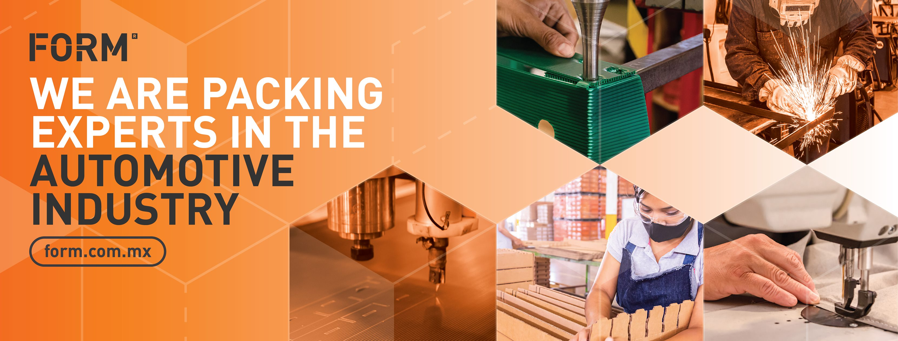

# Case Study FORM

## Problemática

En el corazón de la industria de autopartes, FORM se ha consolidado como un líder en la provisión de soluciones de empaque para componentes automotrices de alto valor. A lo largo de su trayectoria, la empresa ha enfrentado y superado diversos retos, adaptándose a las cambiantes demandas del mercado global y manteniendo un compromiso inquebrantable con la calidad y la innovación. Sin embargo, dos problemáticas principales han surgido como desafíos persistentes que requieren atención especializada y soluciones creativas: la **Rotación de Personal** y la **Predicción de Demanda**. Estos desafíos no solo impactan nuestras operaciones diarias, sino que también plantean interrogantes sobre nuestra capacidad para mantener nuestra posición de liderazgo en el futuro.

## Problemática Mayor 1: Rotación de Personal

La rotación de personal se ha identificado como el desafío más crítico que enfrenta FORM en el presente. A pesar de nuestros esfuerzos continuos para crear un ambiente laboral atractivo y retener a nuestros valiosos empleados, nos encontramos con una tasa de rotación especialmente alta entre los operadores. Este fenómeno no solo afecta la continuidad y la eficiencia de nuestras operaciones, sino que también incrementa los costos asociados con el reclutamiento y la capacitación de nuevo personal.

- **Principales Puntos:**
  - La estabilidad familiar y las condiciones laborales son factores significativos que influyen en la decisión de los empleados de permanecer en la empresa.
  - Los jóvenes, especialmente aquellos sin compromisos familiares, tienden a buscar oportunidades de desarrollo profesional fuera de FORM.
  - Es crucial mejorar nuestras estrategias de reclutamiento y retención para abordar las causas subyacentes de la rotación de personal.

## Problemática Mayor 2: Predicción de Demanda

La predicción precisa de la demanda representa un desafío igualmente significativo para FORM, dada la variabilidad inherente en la producción y venta de autopartes. La habilidad para anticipar con exactitud cuántas unidades de un determinado componente serán necesarias es crucial para optimizar nuestros procesos de producción y empaque, y para asegurar que se maximice la eficiencia en el uso de recursos.

- **Principales Puntos:**
  - La naturaleza fluctuante de la demanda automotriz complica la planificación y gestión de inventarios.
  - Es esencial desarrollar herramientas y procesos más sofisticados para mejorar la precisión en nuestras predicciones de demanda.
  - La adaptabilidad y la capacidad de responder rápidamente a los cambios en el mercado son fundamentales para mantener nuestra competitividad.

FORM enfrenta estos desafíos con un espíritu de innovación y una dedicación inquebrantable a la excelencia. A través de un enfoque estratégico y la implementación de soluciones creativas, estamos comprometidos a superar estas problemáticas y a continuar liderando el camino en la industria de empaques para autopartes.

